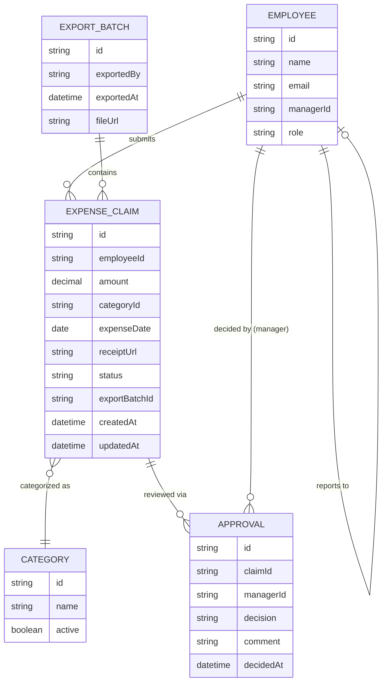

# Domain Model

The domain centers on an expense claim moving through submission, approval, and
payroll export. An employee owns claims; a manager reviews the ones routed to
them; finance exports approved claims in batches.

- **EMPLOYEE** is every signed-in user; `role` distinguishes Employee, Manager,
Finance, and `managerId` is the admin-maintained assignment claim routing
reads.
- **EXPENSE\_CLAIM.status** moves `submitted → approved | rejected`, and a
rejected claim can be edited and resubmitted (back to `submitted`).
`exportBatchId` is set once the claim is included in a payroll export.
- **CATEGORY** is the finance-maintained predefined list claims choose from.
- **APPROVAL** records each manager decision on a claim (kept even across a
resubmission, for history).
- **EXPORT\_BATCH** is one finance export run; every claim it contains gets its
`exportBatchId` set so it can never be exported twice.

