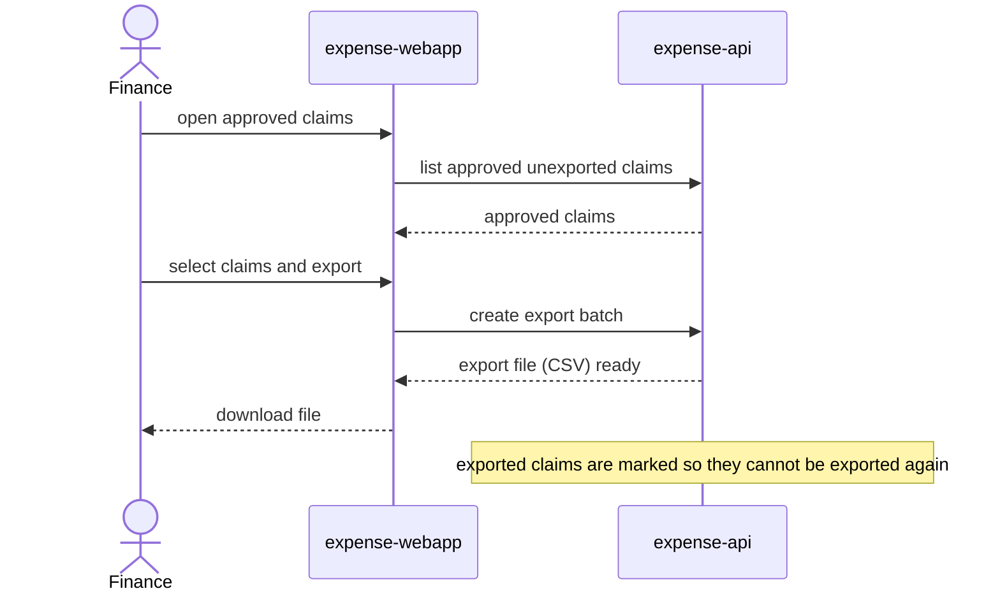

# Export Approved Claims to Payroll

Finance gathers approved, not-yet-exported claims into a downloadable file for
payroll upload.

```mermaid
sequenceDiagram
    actor Finance
    participant expense-webapp
    participant expense-api

    Finance->>expense-webapp: open approved claims
    expense-webapp->>expense-api: list approved unexported claims
    expense-api-->>expense-webapp: approved claims

    Finance->>expense-webapp: select claims and export
    expense-webapp->>expense-api: create export batch
    expense-api-->>expense-webapp: export file (CSV) ready
    expense-webapp-->>Finance: download file

    Note over expense-api: exported claims are marked so they cannot be exported again
```