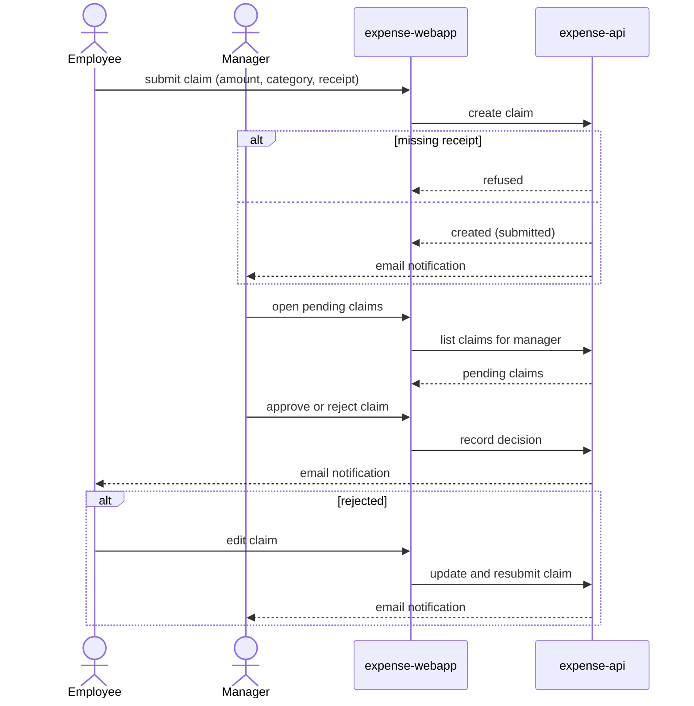

# Submit and Approve a Claim

An employee submits an expense claim, their manager reviews it, and a rejected
claim is corrected and resubmitted.

```mermaid
sequenceDiagram
    actor Employee
    actor Manager
    participant expense-webapp
    participant expense-api

    Employee->>expense-webapp: submit claim (amount, category, receipt)
    expense-webapp->>expense-api: create claim
    alt missing receipt
        expense-api-->>expense-webapp: refused
    else
        expense-api-->>expense-webapp: created (submitted)
        expense-api-->>Manager: email notification
    end

    Manager->>expense-webapp: open pending claims
    expense-webapp->>expense-api: list claims for manager
    expense-api-->>expense-webapp: pending claims

    Manager->>expense-webapp: approve or reject claim
    expense-webapp->>expense-api: record decision
    expense-api-->>Employee: email notification

    alt rejected
        Employee->>expense-webapp: edit claim
        expense-webapp->>expense-api: update and resubmit claim
        expense-api-->>Manager: email notification
    end
```

